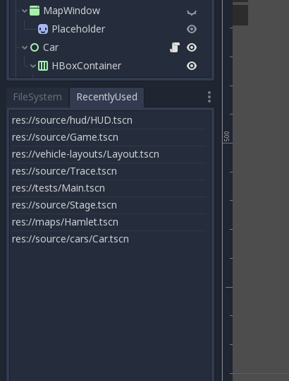

# 'Recently Used' plugin for Godot

The main purpose of this plugin is to track and store scenes that were used recently across a given project (so that they can be opened by double-click later). The results are visible in a `RecentlyUsed` dock which, by default, is placed next to `FileSystem` dock.

Persistence is implemented via config file `user://recently-used.cfg`.

Recently used scenes are the scenes which are opened for a while.

## Known problems (TODO)

 - lag during startup
 - cutting long paths
 - polling(?)
